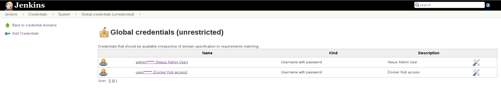
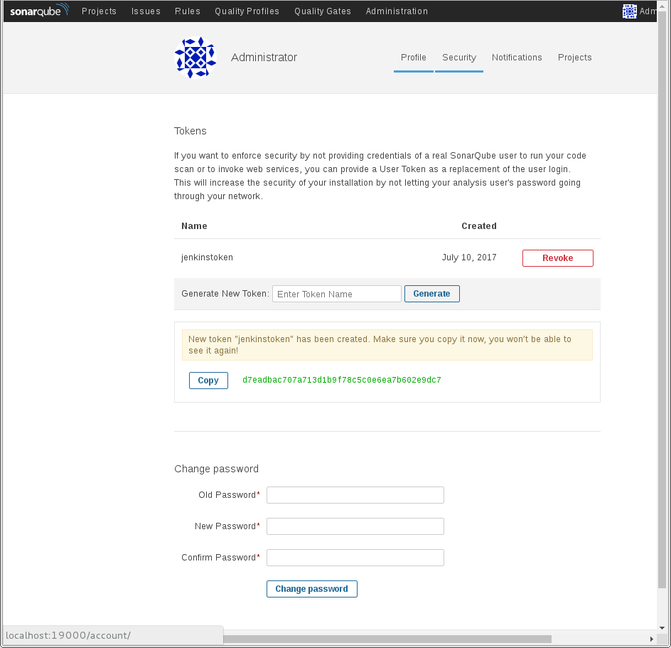
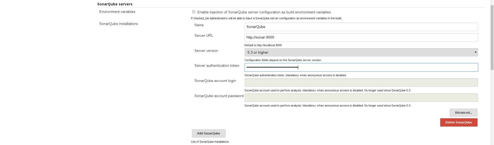
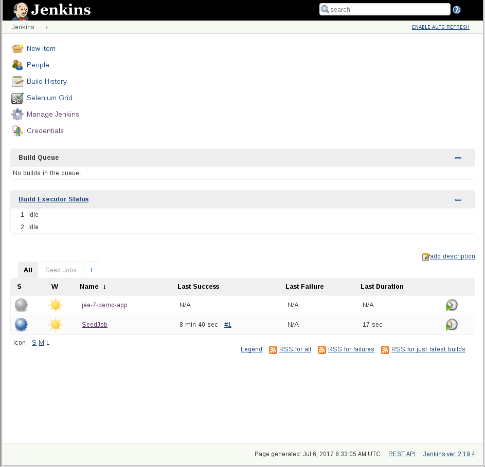
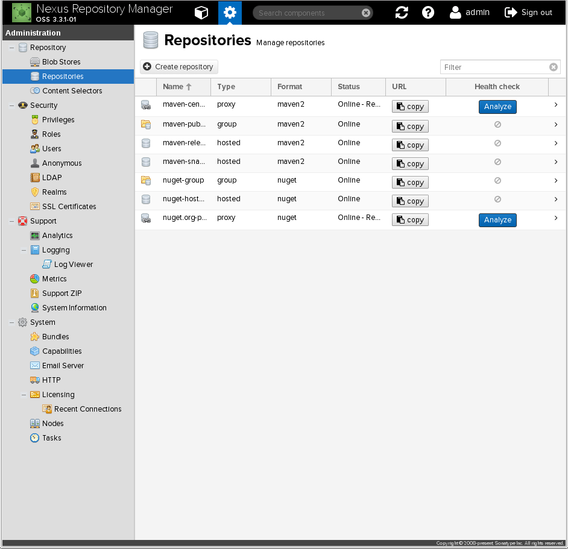
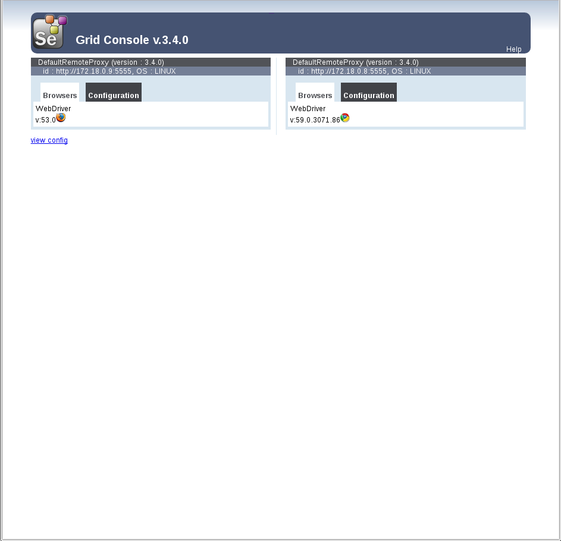

# CI Tools Demo

This GitHub repository contains Dockerfiles for running a set of Continuous Integration Tools with a single command. The diagram contains all tools used in the Docker containers.


Original blog article on the CI Docker Container, https://blog.codecentric.de/en/2015/10/continuous-integration-platform-using-docker-container-jenkins-sonarqube-nexus-gitlab

The setup has been altered with respect to the original configuration and includes a private Docker Registry (provided by Nexus) to receive images built from the Jenkins Pipeline job(s).


## With Docker Linux Native

If you want to use new Docker Mac Native implementation without VirtualBox and Docker Toolbox, follow these steps:

### Step 0 - Install Docker Linux Native

[Install Docker Linux Native](https://docs.docker.com/engine/installation "Install Docker") and afterwards follow the steps described in https://docs.docker.com/compose/install for Docker Compose.

If everything went fine, docker --version should give something like this (or a higher version number):
```
$ docker --version
Docker version 17.06.0-ce, build 02c1d87

$ docker-compose --version
docker-compose version 1.14.0, build c7bdf9e
```

### Step 1 - Clone Repository

```
# Clone Repository
# Option A: clone via https
git clone https://github.com/selste/docker-ci-tool-stack.git --branch wasline

# Option B: if you have your ssh keys configured for your GitHub account
git clone git@github.com:selste/docker-ci-tool-stack.git

cd docker-ci-tool-stack
```

### Step 2 - Build and start containers

```
# Startup containers
# Option A: via the provided shell script
./setup.sh

# Option B: setting an environment variable and running docker-compose up
unset DOCKER_GROUP_ID
export DOCKER_GROUP_ID=`getent group docker | cut -d: -f3`
docker-compose up -d
```
This is necessary because Jenkins needs to have access to the Docker daemon running on the host. Since the id for the 'docker' group is dependent on the distribution (and the method of installation) used, it is dynamically provided as a variable during image creation.

In order to use Selenium for automated GUI tests, execute
```
docker-compose -f docker-compose-selenium.yml up -d
```
as well.

### Step 3 - Postinstallation

#### Jenkins

Two sets of credentials are created on first startup:
1. 'nexus', used to access the Nexus Repository Proxy
2. 'dockerhub', used to push the Docker image created when running the pre-defined Pipeline job to Docker Hub. This credentials set has to updated manually by replacing the id 'user' and the password with a combination valid for access, otherwise the build will fail.


#### GitLab

Jenkins is configured to create a Pipeline job on startup for a project hosted in GitLab. Login to GitLab and create a new project by cloning the demo project hosted on [GitHub](https://github.com/oraum/jee-7-demo-app "jee-7-demo-app"). Make sure the name of the project is *jee-7-demo-app* and that it is *public*.

### Nexus

Nexus has to be configured to provide a private Docker Registry after first startup. Navigate to the *nexus/scripts* folder and execute *repositories.sh* - this will remove some of the preconfigured repositories (e.g. *nuget*) and set up the relevant entries for use with Docker.
Output should look like this:
```
[steffen@linux scripts]$ ./repositories.sh
Processing scripts nuget.json docker.json ...

Creating Integration API Script from nuget.json ... done
Creating Integration API Script from docker.json ... done
Running aliases nuget docker ...

Running alias nuget ... done
Running alias docker ... done
[steffen@linux scripts]$
```

### SonarQube

1. Create an access token in SonarQube. Login, the navigate to the *Security* tab of the account's settings, and create a new token  Don't forget to copy the gerneated token because this will be used in the second step to configure access to SonarQube for Jenkins
2. In Jenkins click *Manage Jenkins*, then go to *Configure Jenkins*. Find the *SonarQube servers* section, click the *Add Sonarqube* button and populate the fields - don't forget to paste the token added in Step 1

Save the changes


## Access Tools

| *Tool* | *Link* | *Credentials* |
| ------------- | ------------- | ------------- |
| Jenkins | http://localhost:18080/ | no login required |
| SonarQube | http://localhost:19000/ | admin/admin |
| Nexus | http://localhost:18081 | admin/admin123 |
| GitLab | http://localhost | root/5iveL!fe |
| Selenium Grid | http://localhost:4444/grid/console | no login required |

## Screenshots

Here is an overview of all tools:

- GitLab is used for storing the Source Code
- Jenkins contains build job and is triggered once projects in GitLab are updated
- As part of the CI build, Jenkins triggers a static code analysis and the results are stored in SonarQube
- The Maven build uses Nexus as a Proxy Repository for all 3rd party libs. The build artifacts are deployed to the Nexus Release Repository
- The Selenium Grid contains Docker containers running Chrome and Firefox and is used for UI tests

### Jenkins Jobs

There are two Pipeline jobs preconfigured in Jenkins.
The Jobs cover the following tasks:
- SeedJob - this job is created via a Groovy script executed on Jenkins startup. The purpose of this job is to create *real* jobs by calling Job-DSL scripts which are located in its workspace. Currently only one job - called *jee-7-demo-app* - is created.
- jee-7-demo-app - a Pipeline job for building the demo application.



### SonarQube Dashboard


### Nexus Repository



### Selenium Grid


